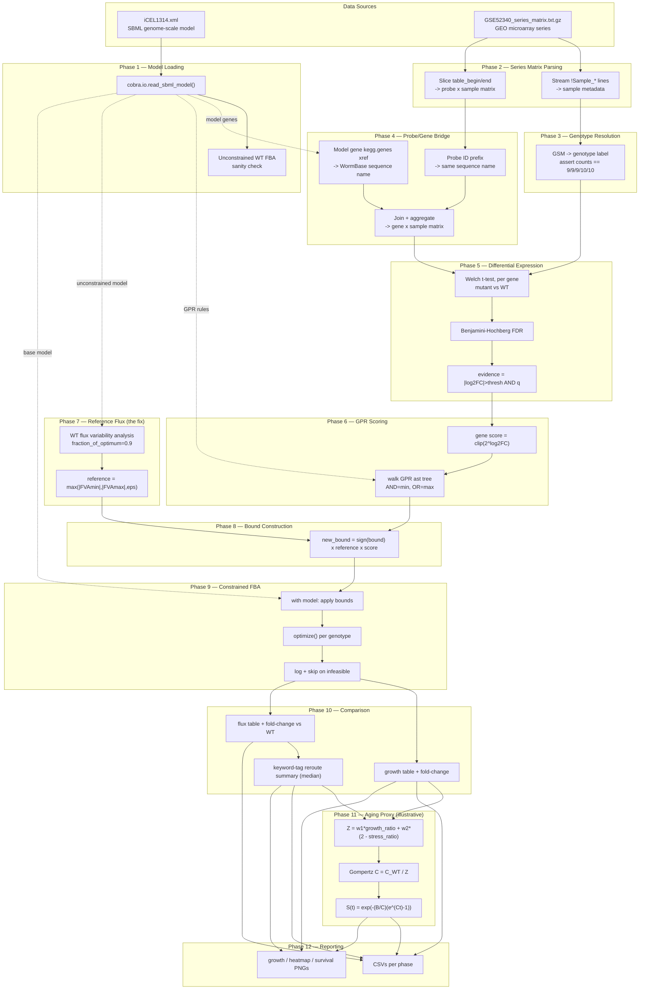

# Implementation Blueprint: Transcriptomics-Constrained FBA Pipeline

A phase-by-phase build guide for the `fluxworm` pipeline, written so you can
implement it yourself, understand *why* each step exists, and audit the
design for flaws before you hit them at runtime. Each phase below maps to a
real module in `src/fluxworm/` — cross-reference as you go. Two phases (7
and 11) include a **"Design flaw to watch for"** box describing a mistake
this project's own first implementation actually made; both were caught
only by running the real pipeline against real data, not by inspection —
build in the verification step described, don't skip it.

Prerequisites this blueprint assumes you have on disk: `iCEL1314.xml`
(SBML L3v1 + FBC v2) and `GSE52340_series_matrix.txt.gz` (a GEO series
matrix). Nothing else — no external downloads are required anywhere in
this pipeline (see Phase 4).

---

## Phase 0 — Environment

**Objective.** Get a working COBRApy + scientific-Python stack before
touching biology, so the first real bug you hit is a modeling bug, not a
missing-package error.

**I/O.** In: nothing. Out: a working interpreter.

**Tech/Math.**
```
pip install cobra pandas numpy scipy statsmodels matplotlib pyyaml pytest
```
`cobra` pulls in `optlang` (the LP modeling layer) and a bundled GLPK
solver via `swiglpk` — no separate solver install needed for a project
this size. Pin `cobra>=0.29`: earlier versions expose gene-reaction rules
as bare strings, not the `GPR` object with a walkable `ast` tree that
Phase 6 depends on.

**Audit checkpoint.** `python -c "import cobra; print(cobra.__version__)"`
and confirm the version. If you're on a very new Python (3.13+), install
in a scratch venv first — some scientific-Python C-extension wheels lag
new interpreter releases by a few months.

---

## Phase 1 — Load and sanity-check the metabolic model

**Objective.** Load `iCEL1314.xml` and confirm it's a *working* model
before building anything on top of it. A model that silently fails to
optimize will make every later phase's results meaningless without
telling you why.

**I/O.** In: path to `iCEL1314.xml`. Out: a `cobra.Model` object; a
confirmed-positive unconstrained wild-type growth rate.

**Tech/Math.** `cobra.io.read_sbml_model()`. Set the objective explicitly
(`model.objective = "BIO0010"`) rather than trusting whatever the file's
default is — SBML files can carry a stale or ambiguous FBC objective
annotation. Run `model.optimize()` once, unconstrained, and assert
`status == "optimal"` and `objective_value > 0`.

**Why this order matters.** Every later phase (constraint-building, FVA,
per-genotype FBA) reuses this same `Model` object via `with model:`
context blocks. If the base model is broken, every downstream phase will
"work" (return *a* number) while being meaningless — so this check has to
run first and has to be loud on failure, not just logged.

**Audit checkpoint.** Print `len(model.reactions)`, `len(model.genes)`,
`len(model.metabolites)` and sanity-check them against the model's
published paper (iCEL1314: 2,230 reactions / 1,314 genes / 1,533
metabolites, Yilmaz & Walhout 2016). A mismatch means you loaded the wrong
file or a corrupted download.

---

## Phase 2 — Parse the GEO series matrix

**Objective.** Extract two *structurally different* things from one gzip
file: (a) per-sample metadata (which GSM accession is which genotype) and
(b) the probe × sample expression matrix. These require different parsing
strategies, and conflating them is the single most common bug in a
first-pass implementation of this step.

**I/O.** In: path to `GSE52340_series_matrix.txt.gz`. Out: two DataFrames
— `sample_headers` (rows = GSM accessions, columns = metadata fields) and
`expression_matrix` (rows = probe IDs, columns = GSM accessions, values =
already-normalized log2-scale intensities).

**Tech/Math.**
- Metadata: every line in the file beginning `!Sample_` is one metadata
  field, tab-separated, one value per sample. Stream the gzip file
  line-by-line with Python's `csv.reader(..., delimiter="\t")` (not
  `pandas.read_csv`) so quoted fields with embedded characters parse
  correctly. GEO allows *multiple* `!Sample_characteristics_ch1` rows (one
  per characteristic dimension — genotype, phenotype, genetic background,
  …) — capture all of them, keyed by the `"key: value"` prefix each row
  shares across every sample.
- Expression matrix: bounded by `!series_matrix_table_begin` /
  `!series_matrix_table_end` markers. Slice out just those lines and hand
  them to `pandas.read_csv(io.StringIO(...), sep="\t", index_col=0)`.

**Design flaw a naive first pass makes (not the boxed one below, but
worth calling out here):** `pandas.read_csv(path, sep="\t", comment="!")`
looks like the obvious one-liner for the *whole* file, and it does
correctly parse the expression matrix — but it also *silently discards
every metadata line*, because they all start with `!`. If your first
implementation only calls this once, you will have expression data but no
way to know which column is which genotype. This is exactly the bug that
stalled the original prototype version of this project.

**Audit checkpoint.** `sample_headers.shape[0]` must equal the number of
GSM columns in `expression_matrix`. Print the unique values of whichever
metadata column holds genotype, and manually confirm the count per group
against the paper before trusting anything downstream — do this once, by
hand, before writing any classifier logic.

---

## Phase 3 — Resolve genotype groups

**Objective.** Turn the raw metadata from Phase 2 into a clean mapping:
GSM accession → one of five genotype labels, with a hard, checked
invariant on group sizes.

**I/O.** In: `sample_headers`. Out: a `pandas.Series` indexed by GSM
accession, values = genotype label.

**Tech/Math.** No fuzzy matching needed here if the source data is clean
(GSE52340's `characteristics_genotype` field is exact, e.g. `"wild type"`,
`"daf-2 rsks-1"`) — but *verify that by hand first* rather than assuming
it. Build the mapping, then assert
`value_counts().to_dict() == expected_counts` where `expected_counts` is
a hardcoded dict you filled in from the paper (here: 9/9/9/10/10, summing
to 47). Raise, don't warn, on mismatch.

**Why the hard assert.** A silently-wrong genotype grouping doesn't crash
anything downstream — it just makes every subsequent differential
expression, constraint, and FBA result wrong in a way that still *looks*
plausible. This is the cheapest possible place to catch that class of
error, so make it impossible to skip.

---

## Phase 4 — Bridge probe IDs to model gene IDs

**Objective.** The expression matrix is indexed by microarray probe ID;
the model is indexed by WormBase gene ID (`WBGene0000####`). Something has
to translate between them.

**I/O.** In: `model` (from Phase 1), `expression_matrix` (from Phase 2).
Out: a probe→gene mapping; a gene × sample expression matrix (probes
aggregated to genes).

**Tech/Math.** *Before* reaching for an external platform-annotation
file, check what identifiers are actually embedded in your two existing
files — you may not need one. In this project: (1) check the series
matrix's `!Series_platform_id` — GSE52340 is `GPL17925`, a NimbleGen
array whose probe IDs are literally `<WormBase sequence name>P<index>`
(e.g. `F35H10.4P00123`); (2) check the model's own gene annotations —
`cobra` parses each SBML gene's MIRIAM cross-references into
`gene.annotation`, and iCEL1314's genes carry a `kegg.genes` entry of the
form `CELE_<sequence name>`. Strip `CELE_` and you have the same sequence
name the probe ID encodes. Join on that string, aggregate multi-probe
genes by mean.

**Why check this before downloading anything.** Reaching for a GPL
platform-annotation file is the "obvious" solution and is what this
project's plan originally called for — but it adds a network dependency,
a versioning question (annotations go stale), and a licensing question,
for information that may already be sitting in your two local files. Grep
both files for identifier formats *first*.

**Audit checkpoint.** Report the match rate (`genes matched / total model
genes`) and expect it to be well under 100% — not every model gene will
be represented on any given array. In this project: 787 of 1,314 (60%).
A near-0% match means your identifier-stripping regex is wrong; a
near-100% match on a real biological array is itself suspicious and worth
double-checking.

---

## Phase 5 — Differential expression

**Objective.** For each mutant genotype, find which of the model's genes
are convincingly up- or down-regulated relative to wild type. This is the
signal that will eventually reshape the metabolic model — get the
statistics right here or everything downstream inherits the error.

**I/O.** In: gene × sample expression matrix, genotype labels. Out: per
genotype, a table indexed by gene ID with columns `log2fc`, `pvalue`,
`qvalue`, `evidence` (bool).

**Tech/Math.**
- `log2fc = mean(mutant samples) − mean(WT samples)` (values are already
  log2-scale, so this is a subtraction, not a ratio).
- `scipy.stats.ttest_ind(..., equal_var=False)` — Welch's t-test,
  because group sizes differ (9 vs. 9/10) and you should not assume equal
  variance between a wild-type and a mutant population.
- `statsmodels.stats.multitest.multipletests(..., method="fdr_bh")` —
  Benjamini–Hochberg FDR correction across all genes tested in that
  comparison. Testing ~800 genes without multiple-testing correction will
  hand you dozens of false positives by chance alone.
- `evidence = (|log2fc| > threshold) & (qvalue < threshold)` — require
  *both* a meaningful effect size and statistical confidence. A tiny,
  highly-significant fold-change (common with large n) and a huge,
  statistically-noisy one (common with small n) are both weak evidence on
  their own.

**Audit checkpoint.** Print the evidence-gene count per genotype and sanity-
check the *ordering*, not just the numbers: a genotype with a stronger
phenotype should usually (not always) show more evidence genes. In this
project, `daf-2` alone (156 genes) showed far more transcriptional
disruption than `rsks-1` alone (40 genes) — a real, measured asymmetry
worth noticing before you proceed, not an error to "fix."

---

## Phase 6 — GPR evaluation: gene scores → reaction scores

**Objective.** A reaction is rarely controlled by exactly one gene. Before
you can rescale a reaction's flux bounds, you need one combined score per
*reaction*, derived from the score of every gene the reaction's GPR rule
names.

**I/O.** In: gene evidence table (Phase 5), `model`. Out: per reaction, a
score (or `None` for reactions with no gene association at all).

**Tech/Math.**
- Per gene: `score = clip(2**log2fc, min_scale, max_scale)` for genes
  with evidence; `score = 1.0` (neutral) otherwise.
- Per reaction: walk `reaction.gpr.body`, a Python `ast` tree (`ast.Name`
  for a bare gene, `ast.BoolOp` with `ast.And`/`ast.Or` for combinations).
  Evaluate recursively: **AND → `min()`** of child scores (an enzyme
  complex is rate-limited by its least-available subunit); **OR →
  `max()`** of child scores (isozymes are redundant — either suffices).
  This convention is standard across the E-Flux/GIMME family of methods,
  not something to invent per-project.
- `reaction.gpr.body is None` (true for exchanges, transport, spontaneous
  reactions, and the biomass reaction itself) → return `None`, meaning
  "leave this reaction's bounds untouched." Don't invent a fallback score
  for these; scaling a reaction that has no gene evidence at all
  misattributes the mutation's mechanism.

**Audit checkpoint.** Unit-test the AND/OR evaluator directly against a
hand-built `ast` tree (`ast.parse("a and b", mode="eval").body`) with
known scores, independent of the real model — this isolates GPR-logic
bugs from data bugs, and is cheap to write.

---

## Phase 7 — Establish a reference flux capacity per reaction

**Objective.** Decide *what number* each reaction's expression score gets
multiplied against. This sounds like a minor implementation detail. It is
not — get it wrong and every constraint you build in Phase 8 will have
zero effect on every FBA run in Phase 9, and you won't find out until
you've already run the whole pipeline.

**I/O.** In: `model` (unconstrained). Out: a reference flux magnitude per
reaction, from wild-type flux variability analysis (FVA).

**Tech/Math.** `cobra.flux_analysis.flux_variability_analysis(model,
fraction_of_optimum=0.9)` — for each reaction, the min/max flux it could
carry while the network still achieves at least 90% of max wild-type
growth. Reference capacity = `max(|min|, |max|, epsilon)`, with a small
`epsilon` floor (not zero) so a reaction unused at wild-type baseline
isn't permanently locked out for every mutant.

> **⚠ Design flaw to watch for — and why this phase exists at all.**
> The *obvious* implementation of Phase 8 is: scale each reaction's own
> existing model bound (`new_bound = original_bound × score`). This is a
> literal reading of E-Flux, and it is what this project's first working
> version actually shipped with. Running it against real data produced a
> **null result**: every mutant genotype's optimal growth, and every
> single reaction's flux, came out numerically identical to wild type.
>
> The cause, found by deliberately forcing several rescaled reactions to
> a hard zero and confirming growth *did* change for some of them (so the
> FBA machinery itself was fine): iCEL1314, like many genome-scale models,
> gives almost every reaction a generic placeholder bound (±1000) rather
> than a measured capacity. Real flux values at this model's optimum run
> roughly 1e-3 to 1e-6. A biologically realistic fold-change (this
> pipeline's evidence threshold is 1.5×, clipped scores top out at 10×)
> multiplied against 1000 never comes close to shrinking the bound down
> to where it would constrain a flux three to six orders of magnitude
> smaller. The constraint was real, on paper, and completely inert, in
> practice.
>
> **The fix is this phase**: scale against a reference grounded in a
> magnitude the model actually uses (its WT FVA range) instead of an
> arbitrary placeholder. If you build Phase 8 directly against
> `reaction.bounds` without this phase, budget time to rediscover this —
> or better, build the FVA reference from the start and skip the
> rediscovery.

**Audit checkpoint.** Before wiring this into Phase 8, spot-check: pick
five reactions that carry non-zero flux in the WT optimum, print their
model bound vs. their FVA-derived reference capacity, and confirm the
latter is *meaningfully smaller*. If the two numbers are close, this
phase isn't fixing anything and you should ask why.

---

## Phase 8 — Build genotype-specific flux bounds

**Objective.** Combine Phases 6 and 7 into an actual, mutant-specific
bounds table, ready to apply to the model.

**I/O.** In: reaction scores (Phase 6), reference capacities (Phase 7).
Out: per genotype, a table indexed by reaction ID with `original_lb/ub`,
`score`, `reference_capacity`, `new_lb/ub`.

**Tech/Math.**
```
new_lb = sign(original_lb) × reference_capacity × score
new_ub = sign(original_ub) × reference_capacity × score
```
Preserve `sign()` per direction so a reversible reaction's forward and
reverse capacity both scale correctly (and an irreversible reaction whose
`lb == 0` stays at exactly 0, since `sign(0) == 0`). Reactions with
`score is None` (Phase 6) keep their original bounds untouched — assert
this in a test, don't just assume the arithmetic falls out that way.

**Audit checkpoint.** For a handful of reactions, print
`original bounds → new bounds` side by side across all mutant genotypes
and eyeball that the direction makes sense: an upregulated gene's
reaction should widen, a downregulated one should narrow, an
evidence-free one should be untouched.

---

## Phase 9 — Constrained FBA per genotype

**Objective.** Solve the actual optimization problem: given each
genotype's resized bounds, what is the best-achievable growth rate and
full flux distribution?

**I/O.** In: `model`, bounds table per genotype (Phase 8). Out: per
genotype, an `FBAResult` (status, objective value, full flux vector).

**Tech/Math.** Flux Balance Analysis — linear programming, maximizing the
biomass objective subject to steady-state mass balance (`S·v = 0`) and
the per-reaction bounds. Run every genotype inside a `with model:`
context so bound edits are automatically rolled back before the next
genotype — never mutate one shared model object across genotypes without
this, or genotype N's constraints will leak into genotype N+1.

**Robustness.** Don't let one infeasible genotype crash the whole run:
catch non-`optimal` status, log which genotype and the applied
score range, and continue to the remaining genotypes. Do treat a
non-optimal *wild-type* run as fatal — every downstream comparison is
relative to it.

**Audit checkpoint.** Confirm wild-type reproduces the Phase 1
unconstrained growth rate (it should, since WT gets no bound scaling at
all — it's the reference every mutant is compared against).

---

## Phase 10 — Cross-genotype comparison

**Objective.** Turn five separate FBA solutions into a comparison that
answers the actual biological question: how, and where, does each
mutant's metabolism differ from wild type?

**I/O.** In: `FBAResult` per genotype. Out: a growth-comparison table; a
reaction × genotype flux table; a per-reaction fold-change-vs-WT table; a
functional-group reroute summary.

**Tech/Math.**
- Growth table: biomass flux and fold-change vs. WT, per genotype.
- Flux fold-change: `|flux_mutant| / (|flux_WT| + epsilon)`, with
  `epsilon` sized to this model's real flux scale (Phase 7's finding
  again — an epsilon far smaller than the model's typical flux will let
  a handful of near-zero-WT-flux reactions produce absurd, uninterpretable
  ratios that dominate any downstream aggregate).
- Group-level summary: iCEL1314 as distributed carries **no subsystem or
  pathway annotation** (check `reaction.subsystem` — if it's empty for
  every reaction, don't assume you loaded the file wrong, some
  distributions of this model simply don't carry it). A defensible
  substitute: tag each reaction with a keyword match against its
  free-text `reaction.name` (e.g. "lipid", "fatty acid"), and aggregate
  fold-change by **median**, not mean — a handful of extreme per-reaction
  ratios (see the epsilon note above) will otherwise dominate a mean and
  misrepresent the group's typical behavior. Label this tag as a
  heuristic explicitly, wherever it's reported — it is not a curated
  pathway assignment.

**Audit checkpoint.** Cross-check the flux-level finding against the
growth-level finding: a genotype with many reactions showing large
fold-changes but near-identical total growth is telling you something
real (rerouting without a yield cost) — don't treat that as a
contradiction to resolve.

---

## Phase 11 — Illustrative aging layer

**Objective.** FBA is a single steady-state snapshot; lifespan is a
process over time. Bridge the gap with an explicitly-labeled,
non-mechanistic proxy — and be precise about what "illustrative" means in
practice.

**I/O.** In: growth comparison + functional-group flux (Phase 10). Out:
per-genotype survival curves.

**Tech/Math.**
- Composite score:
  `Z = biomass_weight·(growth_ratio) + stress_weight·(2.0 − lipid_flux_ratio)`
  — see the boxed warning below for why the second term is
  `2.0 − ratio` and not `ratio`.
- Per-genotype Gompertz rate constant: `C = C_WT / Z` (a higher composite
  score is *defined*, by this formula, to mean slower aging).
- Survival curve: `S(t) = exp(−(B/C)·(exp(C·t) − 1))`, the classical
  Gompertz form; `scipy.integrate.solve_ivp` can solve the equivalent
  `dS/dt = −h(t)·S(t)` form if you later want a time-varying hazard
  instead of the closed-form constant-rate version.

> **⚠ Design flaw to watch for.** The first version of this layer used
> `Z = biomass_weight·growth_ratio + stress_weight·lipid_flux_ratio`
> directly — a positive relationship, on the assumption that "more
> flux through fat-related reactions" sounded like a generically
> favorable signal. Run against this project's real output, it predicted
> the long-lived double mutant would die *sooner* than wild type — the
> exact opposite of the established finding.
>
> The actual cause: in the real data, the longer-lived mutants showed
> *reduced* flux through the lipid-tagged reaction group relative to
> wild type — directionally consistent with the published finding that
> these mutants store *more* fat via *reduced* fatty-acid oxidation (i.e.
> less turnover, not less presence). A direct positive-ratio term
> therefore scored exactly the genotypes that should look favorable as
> *unfavorable*. The fix was flipping the term to `2.0 − ratio`, so a
> below-WT ratio scores above the WT baseline of 1.0.
>
> The general lesson, not specific to lipids: **when you fold a
> real, unpredicted-in-advance measured direction into a hand-tuned
> scoring formula, run it once against real output and check the sign
> against a known ground truth before trusting the formula** — a
> plausible-sounding assumption about which direction is "good" can be
> wrong, and nothing about the math will warn you.

**Audit checkpoint.** Before reporting any curve, check the known ranking
(here: WT and the daf-16-dependent triple mutant roughly level; daf-2 and
the double mutant longer-lived) against your output. If it doesn't match,
the bug is almost certainly a sign or direction issue in the composite
score, not the Gompertz math itself.

---

## Phase 12 — Reporting

**Objective.** Persist every intermediate table (not just final plots) so
a result is auditable after the fact, and produce a small set of figures.

**I/O.** In: every table from Phases 3–11. Out: CSVs per phase, 3 PNG
figures (growth comparison, functional-group heatmap, survival curves).

**Tech/Math.** Plain `pandas.DataFrame.to_csv` per artifact;
`matplotlib` (`Agg` backend, so it runs headless) for figures. Nothing
exotic here — the value is in *what* you persist: constraint tables and
per-genotype differential-expression tables, not just final summary
numbers, so a surprising downstream result can be traced back to its
inputs without re-running the whole pipeline.

---

## Phase 13 — Testing strategy

**Objective.** Make every phase above independently verifiable with a
fast, deterministic test — so a change in one phase can't silently break
another without a test catching it.

**Tech/Math (`pytest`).**
- Phases 2–3: a small hand-built synthetic `series_matrix.txt.gz` fixture
  with known header content — never test metadata parsing against the
  real 30MB file, where you can't easily eyeball whether the expected
  answer is right.
- Phase 6: test the AND/OR evaluator against a hand-built `ast` tree with
  known scores, isolated from any real model.
- Phase 8: test on a tiny hand-built `cobra.Model` (2–3 reactions) where
  you can compute the expected scaled bounds by hand.
- Phase 9: test on the same tiny model — one case that should stay
  optimal, one case deliberately constructed to be infeasible (not via an
  invalid `lb > ub`, which `cobra` rejects at assignment time, but via a
  reaction forced to a fixed flux that exceeds the network's real supply
  capacity) — to confirm the runner logs and continues rather than
  crashing.
- Phase 11: test that `Z` increasing produces a slower-decaying survival
  curve, independent of any real biological data — this is a math check,
  not a biology check.
- Phase 1: one integration test against the *real* model file, marked
  skippable if the file isn't present, confirming it loads and produces
  positive unconstrained growth.

---

## Full Pipeline Flowchart



**ASCII fallback** (if your viewer doesn't render Mermaid):

```
[iCEL1314.xml]                         [GSE52340_series_matrix.txt.gz]
     |                                        |            |
     v                                        v            v
Phase 1: load model,                  Phase 2: parse    Phase 2: parse
sanity-check WT FBA                   !Sample_* lines   probe x sample
     |                                   (metadata)        matrix
     |                                        |               |
     |                                        v               |
     |                              Phase 3: resolve           |
     |                              genotype groups             |
     |                              (assert 9/9/9/10/10)        |
     |                                        |                |
     |<--- model gene kegg.genes xref         |                |
     |             \                          |                |
     |              v                         |                |
     |     Phase 4: bridge probe IDs <--------+----------------+
     |     to WormBase gene IDs
     |     (no external download)
     |              |
     |              v
     |     Phase 5: differential expression
     |     (Welch t-test + BH-FDR per genotype)
     |              |
     |              v
     |     Phase 6: gene score -> reaction score
     |<----(GPR AND/OR tree walk)
     |              |
     v              v
Phase 7: WT flux variability analysis (the critical fix)
     |              |
     v              v
Phase 8: build genotype-specific flux bounds
     |
     v
Phase 9: constrained FBA per genotype (with model: ... optimize())
     |
     v
Phase 10: cross-genotype comparison
   (growth table, flux fold-change, functional-group reroute)
     |
     v
Phase 11: illustrative Gompertz aging proxy
   (Z score -> rate constant -> survival curve)
     |
     v
Phase 12: CSVs + figures
```
